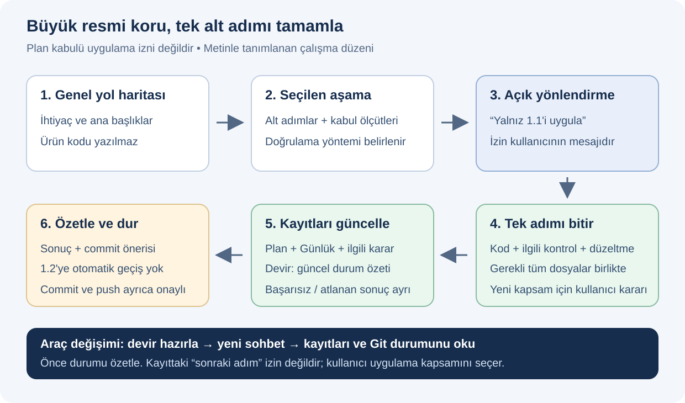
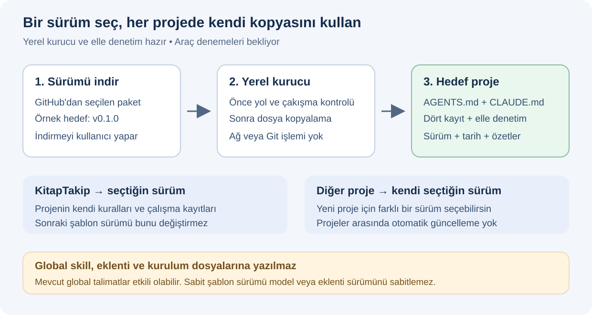

# 🧩 Codex–Claude proje şablonu

**Amaç:** Her yeni projede aynı çalışma düzenini kullanmak; planı birlikte hazırlamak, tek alt adımı uygulamak ve Codex ile Claude arasında repo kayıtlarıyla devam etmek.

> 🚧 **Hedef sürüm: v0.1.0.** **1.1 tamamlandı ve belge/görsel kontrolleri yapıldı; 4 adımın 1'i doğrulandı.** Kurulum, denetim ve VS Code davranış denemeleri sonraki adımlardır. GitHub'da yayımlanmış veya kurulum için hazır bir sürüm değildir.

## 🧭 Çalışma düzeni

Genel yol haritası projenin yönünü gösterir. Ardından yalnız seçtiğin ana aşama alt adımlara ayrılır. Bir alt adım için açık uygulama yönlendirmesi verdiğinde ajan gerekli kodu, ilgili kontrolleri, hata düzeltmelerini ve kayıt güncellemelerini tamamlar; özet ve commit önerisinden sonra durur.

**Planı kabul etmek, kod yazma izni değildir.** Örneğin “Plan uygun” dediğinde ajan bütün planı uygulamaya başlamaz. “Yalnız 1.1'i uygula” dediğinde o adımın birden fazla dosyayı kapsayan gerekli işlerini bitirebilir; 1.2'ye geçmez.



Ajanın problem çözme yeteneğine sınır konmaz; uygulama kapsamı senin seçtiğin adımla sınırlanır. Bu, metinle tanımlanan bir çalışma kuralıdır. Talimatlara uyulması gerçek araç denemeleriyle kontrol edilecektir; teknik bir yetki kilidi veya kusursuz hatırlama garantisi değildir.

## 📦 Proje içine kurulum



Hedef akış şöyle olacak: GitHub'dan belirli sürümü indir → yerel kaynak paketinden hedef klasöre kur → o projede aynı sürümü kullan. Her proje kendi kopyasını taşıyacak. Global skill, eklenti veya kurulum dosyası değiştirilmeyecek; eski projeler kendiliğinden güncellenmeyecek.

**Aşağıdaki komut 1.2 tamamlandıktan sonra kullanılacak. `kur.ps1` henüz yok; şimdi çalıştırılamaz.** Komut, indirdiğin şablon paketinin kökünde Windows PowerShell 5.1 ile çalıştırılacak:

```powershell
powershell.exe -NoProfile -File .\kur.ps1 -TargetDirectory "C:\Projeler\KitapTakip"
```

Kurucu yerel dosyaları kullanacak; Git veya ağ işlemi yapmayacak. Hedef yollar ve çakışmalar dosya yazılmadan kontrol edilecek. Kurulacak dosyalardan biri zaten varsa işlem hiçbir dosyaya dokunmadan duracak. Kaynak paket içine kurulum yapılmayacak. Kurulum sürümü, tarihi ve kaynak dosyaların SHA-256 özetleri kaydedilecek; kopyalama hatasında hangi dosyaların oluştuğu bildirilecek.

Kurucu, şablon deposunun kendi geçmişini taşımayacak. Yeni projeye ortak talimatlar, boş başlangıç belgeleri, elle kontrol betiği ve sürüm kaydı aktarılacak. GitHub'ın “Use this template” özelliği depoyu bütünüyle kopyaladığı için bu projede hedefe kurulumun yerini tutmaz.

Proje içinde kopya kullanmak, mevcut global veya üst klasör talimatlarını otomatik olarak etkisizleştirmez. Sabitlenen şey şablon dosyalarıdır; model ve eklenti sürümleri ayrıca değişebilir.

## 🗂️ Hangi dosya ne işe yarar?

| Dosya veya klasör | Görev | Durum |
|---|---|---|
| [genel/KURALLAR.md](genel/KURALLAR.md) | Ortak kuralların düzenlenecek kaynağı | Mevcut |
| [AGENTS.md](AGENTS.md) | Codex için proje girişi; ortak kuralların kopyası ve bu depoya özel bölüm | Mevcut |
| [CLAUDE.md](CLAUDE.md) | `@AGENTS.md` ile aynı talimatları Claude'a aktaran kısa giriş | Mevcut |
| [docs/PLAN.md](docs/PLAN.md) | Bu şablonun geliştirme planı ve durumları | Mevcut |
| [docs/KARARLAR.md](docs/KARARLAR.md) | Bu şablon için kullanıcının kararları | Mevcut |
| [docs/GUNLUK.md](docs/GUNLUK.md) | Bu şablonda yapılan iş ve kontrol sonuçları | Mevcut |
| [docs/DEVIR.md](docs/DEVIR.md) | Bu şablonda kaldığımız yerin güncel özeti | Mevcut |
| [sablon/docs/PLAN.md](sablon/docs/PLAN.md) ve diğer üç kayıt | Yeni projeye aktarılacak boş başlangıç belgeleri | Mevcut |
| [gorseller/kurulum.svg](gorseller/kurulum.svg), [is-akisi.svg](gorseller/is-akisi.svg) | Kurulum hedefi ve çalışma akışı | Mevcut |
| `kur.ps1`, `surum.json` | Yerel kurucu ve kaynak sürüm bilgisi | 1.2'de hazırlanacak |
| `sablon/.ai-sablon/kontrol.ps1` | Hedef projenin elle kayıt denetimi | 1.3'te hazırlanacak |
| `tests/Kurulum.Tests.ps1` | Ek paket gerektirmeyen kurulum test betiği | 1.3'te hazırlanacak |

`docs/` ve `sablon/docs/` aynı geçmişin iki kopyası değildir: ilki bu şablonun gerçek çalışmasını, ikincisi kurulacak yeni projenin boş başlangıcını taşır. Kurucu tamamlandığında hedef projede belgeler `docs/` altında bulunacak.

Ortak bir kural değişecekse önce `genel/KURALLAR.md` düzenlenir. Bu deponun `AGENTS.md` ortak bölümü de kaynağa uydurulur; proje bölümü korunur. Yeni sürüm eski projelere kendiliğinden yayılmaz. Yalnız projeye özel teknoloji, mimari veya komut kararı ise ilgili projenin `AGENTS.md` proje bölümüne yazılır.

## 🧠 Dört belgeyle ortak hafıza

| Belge | Yanıtladığı soru | Güncellenme zamanı |
|---|---|---|
| **Plan** | Neyi hedefliyoruz; hangi aşama ve adımdayız; kabul ölçütü ne? | Plan netleştiğinde, durum değiştiğinde veya yeni sınır görüldüğünde |
| **Kararlar** | Kullanıcı ne seçti, neden seçti? | Kullanıcı karar verdiğinde |
| **Günlük** | Ne yapıldı, hangi kontrol çalıştı, sonucu ne oldu? | Alt adım tamamlandığında; gerçek sorun ve çözümü görüldüğünde |
| **Devir** | Şu an nerede kaldık, ne yarım, ne bekliyor? | Oturum sonunda ve araç değişiminden önce baştan yazılır |

Bu kayıtları aynı oturumda ajan günceller; ayrıca “günlüğü yaz” demen çalışma kuralı gereği gerekli değildir. Senin görevin ihtiyaçlarını, kararlarını ve uygulanacak alt adımı belirtmektir. Yeni bağımlılık, mimari seçim, gizli ayar veya kapsam değişikliği gibi kontrol noktalarında ajan senden yönlendirme ister.

Dosyaların varlığı, içeriklerinin her oturumda otomatik okunduğunu kanıtlamaz. Yeni oturumda ajan Plan ve Devir'i, ilgili kararları ve Git durumunu okur; tutarsızlıkları bildirir. Salt okunur planlama modunda kayıt yazılamıyorsa bunu bildirir; yazılmış gibi davranmaz.

Proje durumu, karar ve devir bilgisi yalnız repo belgelerine yazılır; aracın özel hafızasına proje durumu kaydedilmez. Sohbet geçmişleri otomatik birleştirilmez. Ortak devam noktası dosyalardır. Devir'de yazan “sonraki adım”, o adımı uygulama izni değildir.

## 📚 Örnek: Kitap takip uygulamasına başlamak

Bu örnek yalnız mesaj akışını anlatır; burada örnek uygulama veya proje klasörü oluşturulmadı.

**1 — İhtiyaç ve genel yol haritası**

> “Kitap eklemek, okuma durumunu değiştirmek ve kitaplarımı listelemek istiyorum. İhtiyaçlarımı netleştir ve yalnız genel yol haritasını hazırla.”

Ajan hedefleri ve belirsiz kararları sorar. Örneğin “1. Kitap kayıtları, 2. Okuma durumları, 3. Arama ve filtreleme” yol haritasını önerebilir. Teknoloji seçimini varsaymaz. Dosya yazmaya izin verilen modda planı kaydeder; ürün kodu yazmaz.

**2 — Seçilen ana aşamanın ayrıntıları**

> “Birinci aşamayı alt adımlara ayır; uygulama yapma.”

Örnek ayrıntılar: **1.1** kitap bilgilerinin ve doğrulama kurallarının tanımı, **1.2** kitap ekleme, **1.3** listeleme. Her alt adımın beklenen davranışı, kabul ölçütü ve doğrulaması yazılır. Diğer ana aşamaların ayrıntıları o aşamalar seçildiğinde hazırlanır.

**3 — Tek alt adımın uygulaması**

> “Yalnız 1.1'i uygula; doğrulamayı ve kayıtları tamamlayınca dur.”

Örneğin 1.1'in kabul ölçütü “boş kitap adı reddedilir; geçerli ad kabul edilir” olabilir. Ajan yetkili kapsamda gerekli dosyaları ve uygun testleri hazırlar, kontrolleri çalıştırır, sonucu kaydeder ve durur. 1.2'deki ekleme arayüzünü kendiliğinden yapmaz.

**4 — Araç değiştirmeden önce**

> “Kayıtları güncelle ve devir hazırla.”

Ajan eksik kayıtları tamamlar ve Devir'i güncel durumla yeniden yazar. Bu istek commit, push veya sonraki adımı uygulama izni değildir.

**5 — Yeni araçta yeni sohbet**

> “Kayıtları ve Git durumunu oku, kaldığımız yeri özetle; uygulamaya başlamadan dur.”

Codex'ten Claude'a veya ters yönde geçtiğinde aynı proje klasörünü açarsın. Önceki aracı durdurursun; iki araç aynı dosyalarda eş zamanlı çalışmaz. Yeni ajan, örneğin “1.1 doğrulandı; 1.2 için yönlendirme bekleniyor” diye durumu özetler. Sen ardından “Yalnız 1.2'yi uygula” diyebilirsin.

Bu mesajlar doğal dildir; yeni bir slash komutu veya global skill kurulmasına ihtiyaç duymaz.

## 🧪 Testler nasıl seçilecek?

Her ayrıntılı adım başlamadan doğrulama yöntemi belirlenir. Davranış değişikliğinde gerekli test yazılır veya mevcut test güncellenir. Alt adım sonunda ilgili testler, ana aşama kapanırken mevcut testlerin tamamı ve gerekli bütünleşme kontrolleri çalıştırılır. Hata düzeltmesinde uygun olduğunda aynı hatayı yeniden yakalayan test eklenir.

Kitap takip örneğinde, seçilmiş teknolojiye bağlı olarak şu katmanlar kullanılabilir:

| Katman | Örnek kontrol | Ne gösterir? |
|---|---|---|
| Birim testi | Boş kitap adının reddedilmesi | Küçük bir iş kuralının beklenen davranışı |
| Bütünleşme testi | Örnek kitap kaydedilip tekrar okunabiliyor mu? | Modüllerin izole test ortamında birlikte çalışması |
| Uçtan uca kontrol | Arayüzden kitap ekleyip listede görmek | Tam kullanıcı akışının test ortamındaki sonucu |
| Kod denetimi | Seçilen dilin biçim ve olası hata kontrolü | Kodun belirli yazım/denetim kurallarına uyması |
| Belge kontrolü | Bağlantı ve komut örneklerinin doğruluğu | Belgenin kullanılabilirliği |

Testler `1.1.Tests` gibi plan numaralarına göre çoğaltılmaz; kitap doğrulama veya depolama gibi özellik/modül sorumluluğuna göre düzenlenir. Adım numarası Günlük kaydında test sonucuyla ilişkilendirilir.

**Flake8**, Python kodunu denetleyen bir araçtır; davranış testlerinin yerini tutmaz. **pytest** Python testlerini çalıştırabilir. Başka dillerde başka araçlar kullanılır. Mevcut araçlarla başlamak esastır; yeni paket için kullanıcı kararı gerekir. Her projeye bütün test araçlarını kurmak gerekli değildir. Test kapsamı beklenen davranışa ve değişikliğin etkisine göre seçilir. [Flake8 belgeleri](https://flake8.pycqa.org/en/latest/glossary.html), [pytest başlangıcı](https://docs.pytest.org/en/stable/getting-started.html).

Başarısız, atlanan (`skipped`) veya çalıştırılamayan kontroller ayrı yazılır. Çözülemeyen başarısızlık bildirilir; gerekli doğrulama yapılmadan adım “doğrulandı” sayılmaz. Testlerin geçmesi canlı ortamın doğru çalıştığını kanıtlamaz. Gerçek veriyi değiştiren veya canlı sistemde işlem yapan komutları sen çalıştırırsın; ajan komutu ve beklenen kanıtı açıklar.

## 🧱 Dosya bütünlüğü ve mimari

Alt başlıklar iş sırasını yönetir; dosyalar sorumluluğuna göre düzenlenir. Aynı alt adım birden fazla dosyada değişiklik gerektirebilir. Ajan, değişikliğin kullanan modüllere etkisini inceleyip uygun kontrollerle bütünlüğü korumaya çalışır.

Bu düzen Singleton tasarım desenini otomatik sağlamaz ve her projeye Singleton dayatmaz. Singleton, bir sınıfın tek örneğinin kullanılmasını amaçlayan bir tasarım tercihidir. Gerekirse proje mimarisi görüşülür; karar ve sınırlar kaydedilir.

## ✅ Elle denetim ve Git

1.3'te hazırlanacak denetim betiği dosya varlığını, belge bağlantılarını, sürüm kaydını ve eksik çalışma kayıtlarını kontrol edecek. **Kullanıcı onayının gerçekliğini, testlerin gerçekten çalıştığını veya kodun doğru olduğunu kanıtlamayacak.** İlk sürümde hook, otomatik engelleme veya yeni paket bulunmayacak.

Git deposunu, GitHub uzak adresini ve Git kimliğini sen kurarsın. Ajan yerel doğrulamaları tamamlar; dosya listesi ve Türkçe commit mesajı önerir. Açık onaydan sonra commit yapılır; push ayrıca onay gerektirir. `.gitignore` kapsamındaki yerel dosyalar commit edilmez; toplu `git add .` kullanılmaz.

[GitHub deposu](https://github.com/Emir-Ars/AI-Sablonum) ve yerel Git deposu kullanıcı tarafından oluşturuldu; dal `main`, uzak adres `origin` olarak tanımlı. Bu belgeler 1.1 kapsamını taşır; commit geçmişi Git'ten, yapılan kontroller Günlük'ten okunur. GitHub'a push ve sürüm etiketi ayrı işlemlerdir. Kurallar Windows PowerShell 5.1'i esas alır: `.ps1` UTF-8 BOM'lu, Markdown/JSON/YAML UTF-8 BOM'suz saklanır.

## 🛠️ Geliştirme durumu

| Adım | İçerik | Durum |
|---|---|---|
| 1.1 | Kurallar, dört kayıt modeli, README, iki SVG | Doğrulandı — 12 Markdown, 2 SVG |
| 1.2 | Kurucu ve kaynak sürüm kaydı | Planlandı |
| 1.3 | Elle denetim ve bağımlılıksız test betiği | Planlandı |
| 1.4 | Codex/Claude VS Code davranış denemeleri | Planlandı |

Ayrıntılı durum ve kabul ölçütleri [Plan](docs/PLAN.md), gerçek kontrol sonuçları [Günlük](docs/GUNLUK.md), sonraki oturumun başlangıcı [Devir](docs/DEVIR.md) dosyasındadır. Genel planın kabulü sonraki adımların uygulama izni değildir.

## 🔎 Resmî kaynaklar ve doğrulama sınırı

Codex'in proje talimat girişi `AGENTS.md` üzerine, Claude'un girişi ise `CLAUDE.md` içe aktarımı üzerine kuruludur. Bu dosya mekanizmaları belgelenmiştir; bizim kurallarımızın iki araçtaki gerçek davranışı 1.4'te ayrıca denenecektir. [Codex AGENTS.md](https://learn.chatgpt.com/docs/agent-configuration/agents-md), [Claude talimatları ve içe aktarım](https://code.claude.com/docs/en/memory).

VS Code kullanımı için [Codex IDE belgeleri](https://learn.chatgpt.com/docs/codex/ide) ve [Claude VS Code belgeleri](https://code.claude.com/docs/en/vs-code) esas alınır. Depo şablonuyla bütün depoyu çoğaltmanın farkı [GitHub şablon belgelerinde](https://docs.github.com/en/repositories/creating-and-managing-repositories/creating-a-repository-from-a-template) açıklanır. İleride testleri GitHub'da otomatik çalıştırmak ayrı bir proje kararıdır: [GitHub sürekli bütünleşme belgeleri](https://docs.github.com/en/actions/get-started/continuous-integration).
